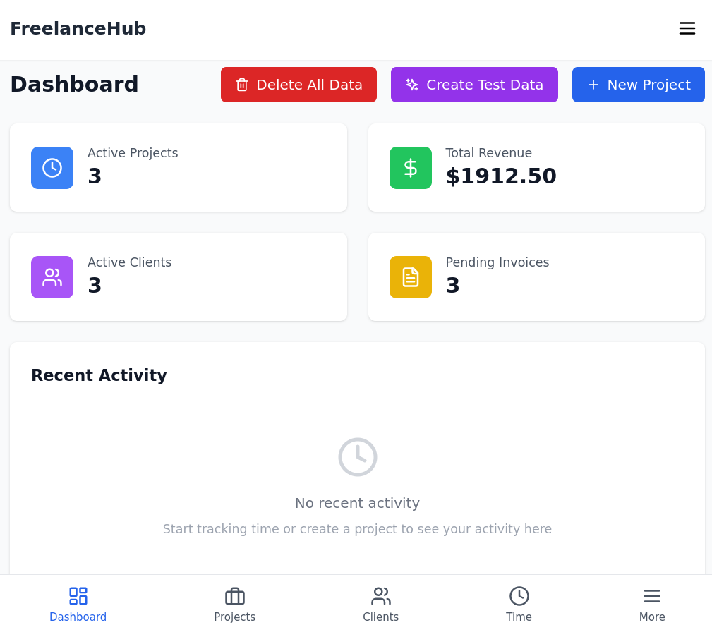
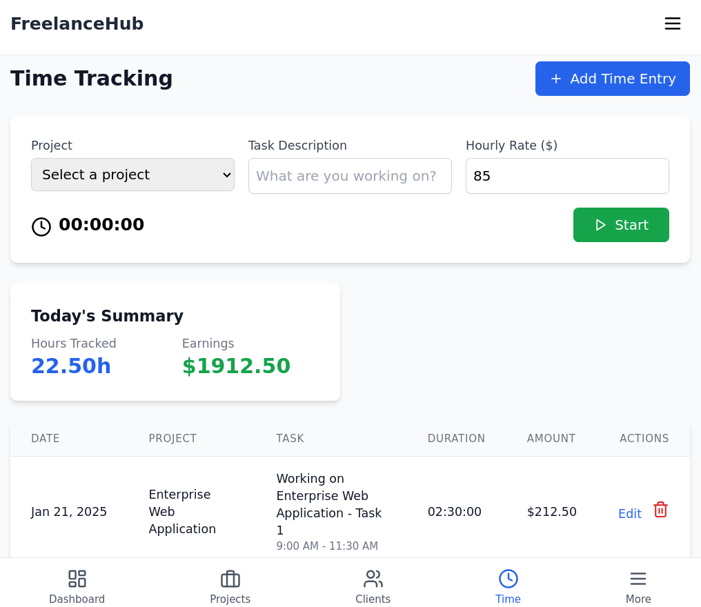

# FreelanceHub

[](https://opensource.org/licenses/Apache-2.0)  [](https://reactjs.org/)  [](https://www.typescriptlang.org/)  [](https://vitejs.dev/)  [](https://tailwindcss.com/)

A comprehensive freelance project management system built with React, TypeScript, and Tailwind CSS.

## Features

- **Project Management**: Track and manage multiple projects with detailed information
- **Client Management**: Maintain a database of clients and their information
- **Time Tracking**: Built-in time tracking with start/stop functionality
- **Invoicing**: Generate and manage invoices with line items
- **Expense Tracking**: Track project-related expenses with receipt management
- **Document Management**: Store and organize project-related documents
- **Milestone Tracking**: Set and track project milestones
- **Responsive Design**: Works seamlessly on desktop and mobile devices

## Tech Stack

- React 18
- TypeScript
- Tailwind CSS
- Vite
- React Router
- Lucide Icons
- date-fns

## Getting Started

1. Clone the repository:

```bash
git clone https://github.com/yourusername/freelancehub.git
cd freelancehub
```

2. Install dependencies:

```bash
npm install
```

3. Start the development server:

```bash
npm run dev
```

4. Open your browser and navigate to `http://localhost:5173`

## Project Structure

```
src/
├── components/        # Reusable UI components
├── pages/            # Page components
├── services/         # Business logic and data services
├── types/            # TypeScript type definitions
└── main.tsx         # Application entry point
```

## Key Features

### Project Management

- Create and manage projects
- Track project status and progress
- Set project budgets and timelines

### Time Tracking

- Real-time time tracking
- Manual time entry
- Project-based time tracking
- Automatic earnings calculation

### Invoicing

- Create professional invoices
- Track payment status
- Generate detailed line items
- Calculate totals automatically

### Expense Management

- Track project expenses
- Categorize expenses
- Upload and store receipts
- Generate expense reports

### Document Management

- Store project documents
- Organize by project
- Track document versions
- Support multiple file types





## Data Storage

The application uses browser localStorage for data persistence. In a production environment, this should be replaced with a proper backend database.

## Creator

Ed Bates (TECHBLIP LLC)

## Acknowledgments

Some sections of this code were generated with the assistance of AI tools.   These contributions were reviewed and integrated by the project creator(s).

## License

Apache-2.0 License - see the [LICENSE](LICENSE) file for details